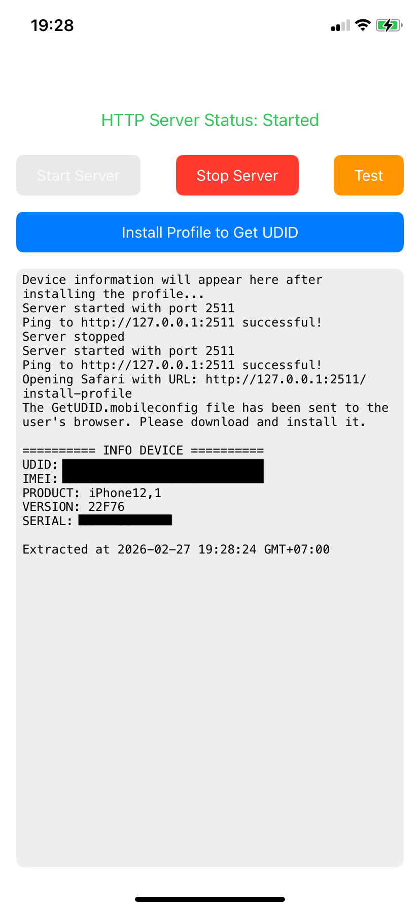
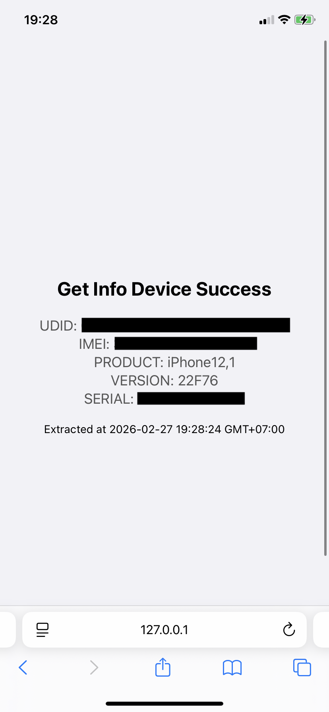

# Get UDID Local Swift

GetUDID Mobileconfig

Get‑UDID Local là một ứng dụng iOS mẫu giúp trích xuất UDID của thiết bị mà không gửi dữ liệu ra ngoài. Thay vì sử dụng các dịch vụ trực tuyến, ứng dụng này khởi chạy một máy chủ HTTP cục bộ trên thiết bị (mặc định là 127.0.0.1:2511) và phục vụ một hồ sơ cấu hình (mobileconfig) yêu cầu hệ thống iOS gửi lại thông tin thiết bị. Khi hồ sơ được cài đặt, thiết bị sẽ truyền các thuộc tính như UDID, IMEI, PRODUCT, VERSION và SERIAL về máy chủ cục bộ, sau đó ứng dụng hiển thị chúng cho người dùng.

---

  
  &nbsp;&nbsp;
  

---

Custom by <a href="https://github.com/letienndat">me</a>
 
Thanks <a href="https://github.com/thanhdo1110/Get-UDID-Local">@thanhdo1110</a>